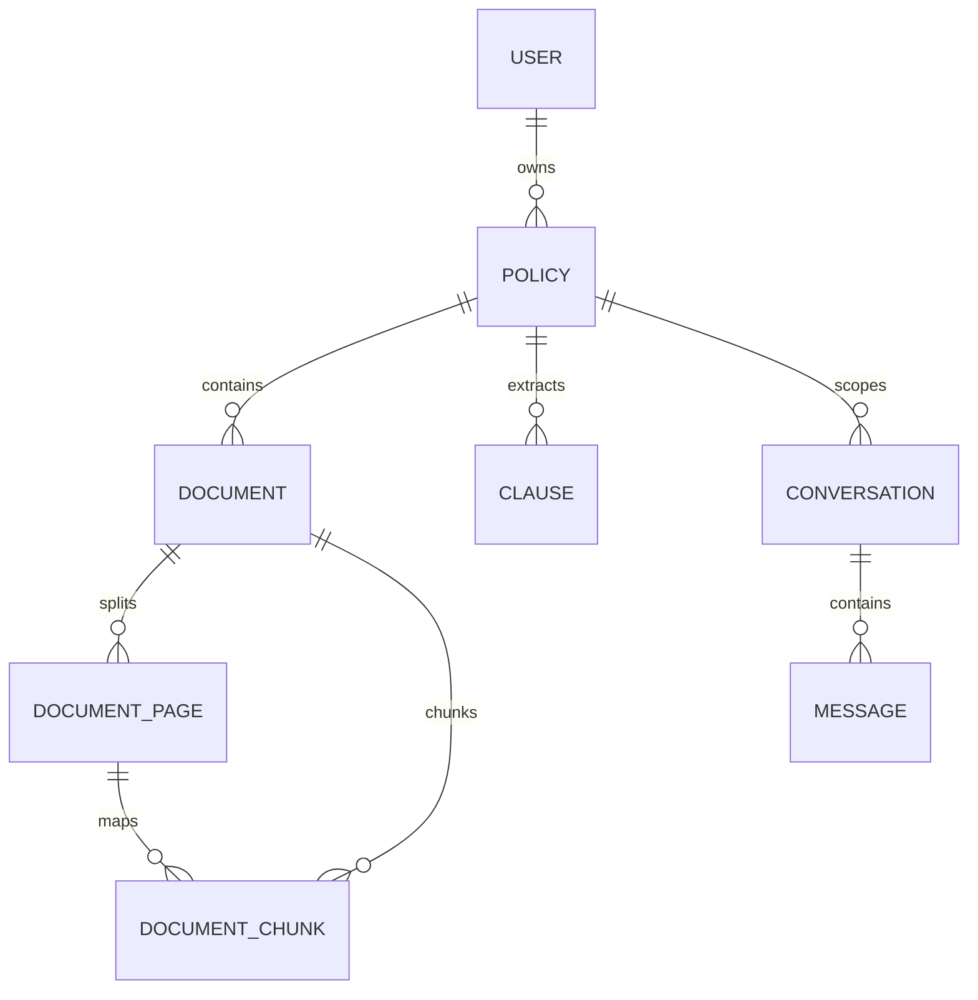

# Database Architecture & pgvector Schema

## 1. Schema Design Overview

PolicyLens AI utilizes PostgreSQL 16 with the `pgvector` extension. All foreign-key relationships maintain strict cascading and relational indexing to eliminate table scans and prevent dangling records.



---

## 2. Table Specifications

### `accounts_user`
- `id` (UUID, Primary Key)
- `email` (VarChar 255, Unique, Indexed)
- `password` (VarChar 128, PBKDF2 SHA-256)
- `created_at`, `updated_at` (Timestamp with timezone)

### `policies_policy`
- `id` (UUID, Primary Key)
- `user_id` (UUID, FK to `accounts_user`, Indexed)
- `name` (VarChar 255)
- `provider` (VarChar 255)
- `policy_type` (VarChar 50: `INDIVIDUAL`, `FAMILY_FLOATER`, `GROUP`, `SENIOR_CITIZEN`)
- `status` (VarChar 50: `PENDING`, `ANALYZING`, `COMPLETED`, `FAILED`)
- `analyzed_at` (Timestamp with timezone, Nullable)

### `documents_document`
- `id` (UUID, Primary Key)
- `policy_id` (UUID, FK to `policies_policy`, Indexed)
- `file` (FileField pointing to private media storage)
- `original_filename` (VarChar 255)
- `file_size` (PositiveBigIntegerField, bytes)
- `file_hash` (VarChar 64, SHA-256 for duplicate detection, Indexed)
- `processing_status` (VarChar 50: `UPLOADED`, `EXTRACTING`, `OCR`, `CHUNKING`, `COMPLETED`, `FAILED`)

### `documents_documentpage`
- `id` (UUID, Primary Key)
- `document_id` (UUID, FK to `documents_document`, Indexed)
- `page_number` (PositiveIntegerField, Indexed)
- `extracted_text` (TextField)
- `extraction_method` (VarChar 50: `PYMUPDF`, `OCR_TESSERACT`, `HYBRID`)
- **Constraints:** `UniqueConstraint(document_id, page_number)`

### `documents_documentchunk`
- `id` (UUID, Primary Key)
- `document_id` (UUID, FK to `documents_document`, Indexed)
- `page_id` (UUID, FK to `documents_documentpage`, Indexed)
- `chunk_index` (PositiveIntegerField)
- `content` (TextField)
- `embedding` (`VectorField(dimensions=768)`, pgvector cosine indexing)
- `metadata` (JSONField: `page_number`, `section`, `chunk_index`)
- **Constraints:** `UniqueConstraint(document_id, chunk_index)`

### `clauses_clause`
- `id` (UUID, Primary Key)
- `policy_id` (UUID, FK to `policies_policy`, Indexed)
- `category` (VarChar 50: `COVERAGE`, `EXCLUSION`, `WAITING_PERIOD`, `DEDUCTIBLE`, `LIMIT`, `CONDITION`, `CLAIM_REQUIREMENT`)
- `title` (VarChar 255)
- `explanation` (TextField, Consumer plain-language summary)
- `source_text` (TextField, Exact verbatim quote from PDF)
- `page_number` (PositiveIntegerField, Physical document page reference)
- `section` (VarChar 255, Heading or chapter name)
- `confidence` (FloatField, 0.0 to 1.0)

---

## 3. Vector Search Implementation

Policy similarity search executes directly in PostgreSQL:

```sql
SELECT id, content, metadata, 1 - (embedding <=> %(query_vector)s) AS similarity
FROM documents_documentchunk
WHERE document_id IN (
    SELECT id FROM documents_document WHERE policy_id = %(policy_id)s
)
AND embedding IS NOT NULL
ORDER BY embedding <=> %(query_vector)s
LIMIT 5;
```

This ensures zero cross-tenant chunk leakage and avoids materializing thousands of vectors in Python memory.

